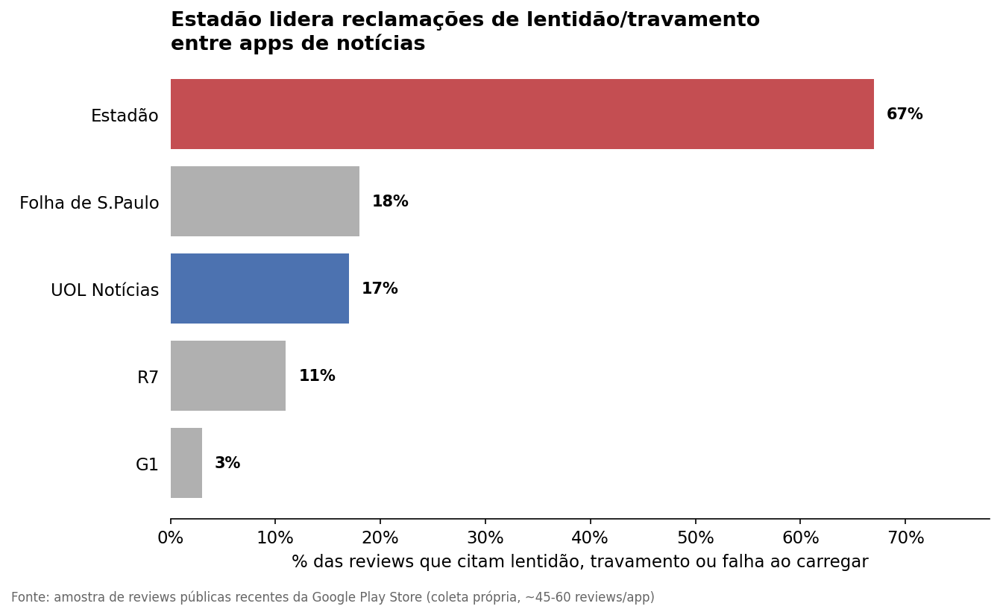

# 📰 Análise de Reviews de Apps de Notícias com IA

> Mini-estudo de produto: extraindo temas e insights acionáveis de reviews
> públicas da Play Store, com apoio de IA generativa, comparando o UOL
> Notícias a 4 concorrentes diretos.

## 🎯 O problema

Apps de notícias recebem milhares de reviews públicas, mas poucas equipes de
produto têm tempo de ler review por review para identificar padrões. Este
projeto testa um fluxo leve — coleta + IA — para transformar feedback não
estruturado em insights priorizáveis, comparando o **UOL Notícias** a 4
concorrentes diretos: **G1, Folha de S.Paulo, Estadão e R7**.

## 🧠 Hipótese

Reviews públicas, mesmo sem estrutura, concentram sinais recorrentes
(reclamações sobre anúncios, performance, paywall) que podem ser extraídos
com apoio de IA generativa mais rápido do que com leitura manual — e ainda
assim com qualidade suficiente para embasar decisões de priorização.

## ⚙️ Método

1. **Coleta:** script Python (`scraper.py`) usando a biblioteca
   `google-play-scraper` para extrair ~60 reviews públicas recentes de cada
   um dos 5 apps de notícias.
2. **Extração de temas e sentimento com IA:** as reviews coletadas foram
   processadas por um LLM (Claude), usando um prompt estruturado
   (`prompt_analise_ia.md`) para identificar temas recorrentes, sentimento
   predominante, frequência e implicações de produto.
3. **Consolidação e visualização:** os temas extraídos foram agregados e
   visualizados por frequência entre os 5 apps.

## 🏆 Achado principal: performance é o maior risco competitivo



O **Estadão concentra 67% das reviews citando lentidão, travamento ou falha
ao carregar** — disparado o pior da categoria nesta amostra. O UOL Notícias
(17%) está em linha com a Folha (18%), enquanto o **G1 (3%)** é o benchmark
de melhor desempenho percebido.

## 📊 Temas consolidados

| Tema | Onde é mais forte | Sentimento | Implicação de produto |
|---|---|---|---|
| Lentidão / travamento ao abrir | Estadão (67%), Folha (18%), UOL (17%) | Negativo | Monitorar tempo de abertura como métrica de produto; G1 como benchmark interno |
| Cancelamento de assinatura difícil | Folha (~18% das reviews) | Negativo | Cancelamento simples como possível diferencial de confiança |
| Anúncios para assinantes pagantes | UOL, Estadão, G1 | Negativo | Revisar regras de exibição de anúncio por tipo de assinatura |
| Falta de modo escuro | **UOL Notícias (exclusivo)** | Negativo | Quick win — feature de baixo esforço e alta demanda explícita |
| Redirecionamento para Folha sem acesso | **UOL Notícias (exclusivo)** | Negativo | Mapear jornada cross-brand; risco de percepção de "enganação" |
| Acessibilidade (PCD) | UOL Notícias | Negativo | Avaliar auditoria de acessibilidade |
| Bugs de login/autenticação | Folha, R7, UOL | Negativo | Investigar fluxo de autenticação entre apps do grupo |

## 🎯 As 3 implicações mais relevantes para o UOL Notícias

1. **Modo escuro ausente é o pedido mais repetido e específico do UOL** —
   aparece em múltiplas reviews ao longo de meses, sempre como crítica
   direta. Provavelmente o quick win de maior relação esforço/impacto
   identificado nesta análise.

2. **A integração de conteúdo com a Folha está quebrando a confiança do
   assinante UOL** — relatos de usuários pagantes redirecionados para
   conteúdo da Folha que não conseguem ler ou comentar. Percebido como
   "enganação" pelos próprios usuários — risco reputacional direto.

3. **UOL não está em desvantagem de performance frente à Folha, mas também
   não se destaca como o G1** — espaço para usar performance como
   diferencial competitivo, especialmente dado o quão mal o Estadão está
   performando nesse quesito.

## ⚠️ Limitações

- Amostra de ~45-60 reviews por app, ordenadas pelas mais recentes — não é
  estatisticamente representativa
- Reviews têm viés de seleção (usuários muito insatisfeitos ou muito
  engajados tendem a escrever mais)
- R7 mistura reviews sobre o app de notícias com funcionalidades de TV/reality
  show, o que dilui a comparabilidade direta nesse caso específico
- Classificação de tema/sentimento via IA generativa é uma aproximação útil
  para priorização exploratória, não substitui análise qualitativa profunda

## 🔁 Próximos passos

- Aumentar o volume de reviews e repetir a coleta periodicamente para
  observar tendência ao longo do tempo
- Cruzar os temas extraídos com dados internos de produto para validar se
  os sinais públicos refletem o uso real
- Automatizar a etapa de extração via API, eliminando o processo manual de
  colar lotes

## 🛠️ Stack

`Python` · `google-play-scraper` · `pandas` · `matplotlib` · `Claude (Anthropic)` para extração de temas/sentimento

## 🔄 Como reproduzir

Veja [`COMO_RODAR.md`](COMO_RODAR.md) para o passo a passo completo.

```bash
pip install -r requirements.txt
python scraper.py
```

---

📫 Yasmin De Matos · [LinkedIn](https://www.linkedin.com/in/yasmindematos/)
